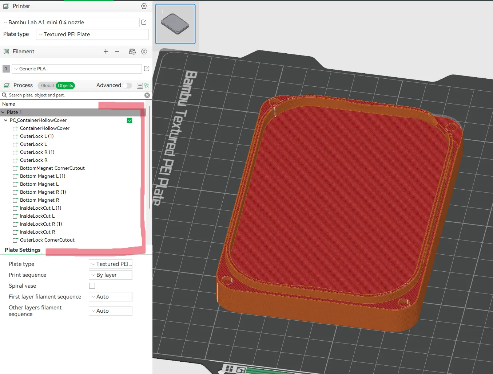

# 3MFModExport

## 3MFModExport - Fusion 360 plugin

Creates and processes 3mf files, turning selected models into slicer special types - modifiers, negative parts, support enforces, blockers.

Improves prototyping experience - no need to manually reapply types onto bodies after every export, or create multiple designs for a feature which now can be turned on / off in the slicer by removing mod parts.

Every modifier, support enforcer / blocker, just like any regular body, can be managed and parametrized in Fusion 360.

Similarly, for prints with many optional parts or variants, instead slicing multiple files or adding trays in the same 3MF file. Instead we can provide a full set of modifiers and negative parts for the end user to decide, modify on their own.

> [!Tip]
> Basically change regular bodies into slicer special objects (like modifiers) during export.

---

### Installation

1. Copy the plugin into a catalog with other Fusion 360 plugins or make a new one.
2. Run ‘python -m bin.setup’
    1. it’ll create required catalogs in the plugin catalog.
    2. and call ‘pip install’
        1. *in case of any issues with pip, this plugin can run without extra dependencies.*
        2. *or if the package is acting up, simply remove it from “{plugin_install_location}/dist/packages” and restart the plugin.*
3. In Fusion 360, navigate to Add-Ins window and tab and add this add-in.
    1. Upon clicking on the green plus - you will be prompted to select a folder with a new add-in:
        

            
        

Upon which the plugin should show up in Utils tab of Fusion 360 Design section.

---

### Basic features

#### MOD parts

> [!Tip]
> Basically change regular bodies into slicer special objects (like modifiers) during export.

Rather than after an export changing the parts into a modifiers manually in the slicer, the plugin rewrites them to such directly in 3MF file.

    
    

 

#### Organize parts in a single space

Instead recreating or importing objects as special parts in the slicer manually. We can just treat them as any other Fusion 360 bodies under a component.
It's especially convenient when we need modifier parts in precisely chosen places - ie. to apply fuzzy skin, or increase number of walls.

    
    

#### Multi color objects

Plugin automatically applies Fusion 360 appearances as filaments colors*

* tested in Orca Slicer and Bambu Studio.

*This version of the plugin will only recognize that each model should have a distinct color applied. Not the order, accurate RGBA value or type of filament or anything else.*

*In theory we can generate a stub settings file, which slicer interprets and configures the correct filament colors.*

*But:*
- *This kinda only worked in Orca Slicer.*
- *Importing such file prompts slicer to show a warning about custom settings.*
- *And finally these settings usually include everything, from the filament temperature, to printer type, gcode and presets.*

*For now better to leave it for slicers to handle.*

Example of an export containing multi color model:

    

> Default view upon opening the standard or processed 3mf file in the slicer:

    

> **Processed 3mf** file after clicking “Add filament” multiple times:
> *(each block retain it’s unique appearance assignment, THOUGH it receives a random color from the slicer. In case you have predefined  spools in your AMS, they’ll be used instead)*

    

> And the outcome of the same action in model exported via **standard “Save as mesh”**, where color assignment on most blocks is missing.

    

Granted, we can most likely use Fusion 360 manufacturing section for 3D printing to achieve most of that(?). I just find this easier plus the manufacturing presets don’t include Bambu Labs devices (I only own and design for) and it seems to place emphasis on a different kind of workflow.

---

### Plugin Widgets

#### Export

Export feature, by default and by the nature of the feature, will only export models to 3MF file.

Right now it’s only possible to export a single component at a time.

Although child components are included when exporting a parent.

    

> [!NOTE]
> All bodies intended for export MUST use the context aware naming convention - otherwise the plugin will fail. Marking the objects as “*not visible*” (eye icon) will omit them from the export.

#### ContextHelper - renaming bodies

Bodies can be easily renamed with the ContextHelper:

    

We can select multiple bodies and with a click on a “Change selected to” button, plugin will rename bodies.

    

> [!IMPORTANT]
> For every export / body with modifiers - there **MUST** exist at least one MAIN part. Modifiers and such, can’t exist in the slicer without an actual part they’re attached to. And this plugin needs one MAIN body in order to correctly group all the mod parts.

> [!NOTE]
> Current version will select shortened name of the parent component as the prefix. The prefix is very important, it’s used by the processing script to group all the parts together.

More about naming convention:

This is rather rudimentary setup, based on naming I've been using prior writing this plugin, that helped me organize and find the objects to be updated in the slicer.
In future I might replace it with a standalone config widget, which will link bodies to object types and more 3d printing related settings.

    

- `$` - static token, MUST be present in order for the processing script to work correctly.
- `PC` - unique identifier. Plugin derives it from the name of the component.
- `PART, MAIN, MOD` - static token. Readable object types name, which will turn into such parts in the slicer.
    - *part and main or token that’s unrecognizable - are automatically converted to normal, printable, part.*
- `Outer_Lock, (…)` - the original name of our object. This name will show up on the slicer objects list.
- `_` - delimiter token.
    - Double `__` separates the component name from the type;
    - Single `_` tells processing script when the object type name has ended *(so the rest of the string is recognized as object name).*

#### ContextHelper - changing object types appearance

Within the ContextHelper → Appearance tab, we can decide whether the renaming action should be accompanied by apperance change.

We can change appearance associated with each object type, disable the apply action for the selected type, as well as quickly disable it for all, with the “Apply Appearance” checkbox (in the ”Helpers” tab).

    

All in all the appearances are quite helpful as they make the objects visually distinct from the others in the viewport.

---

Known issues

- All bodies we wish to export with the plugin must be renamed or made “not visible” (eye icon) so they can be omitted from the export.
    - Object with incorrect name (braking the naming convention) will cause the processing script to intentionally fail the entire process.
- Sometimes when we open the “{}_processed.3mf”, slicers might throw an error saying “there’s no geometry data” in the file. Usually running the export again solves this.
- Mind that the plugin unpacks its own and user favorites appearances libraries into “{plugin_install_location}/dist/resources”
    - Currently it’s done only once when plugin is started for the first time. So as a result any new favorites will not show in the object types appearances selection dropdowns.
    - Right now we have to force script to reload those, by removing the “{plugin_install_location}/dist/resources” content

        > [!NOTE]
        > this will also remove the assigned appearances settings. You can avoid this by retaining the “parts_appearance_settings.json” and removing everything else.

    - And make sure the “ContextAwareSlicerAppearanceV{n}” library has been removed from Fusion 360 (it’s done automatically on plugin stop, but we can do it manually in F360 “Manage Materials” window).
- The same goes when the plugin acts up. Reload it entirely by stopping the add-in, remove all dist/resources and ContextAware… library from the Manage Materials and try starting the plugin again.
- Plugin “requires” pillow package for image resizing. It’ll work without it, but the material miniatures in Appearance selection dropdowns will be given to Fusion 360 in their full size, instead resized to smaller resolutions.
    - This shouldn’t cause any discernable issues, though at one point unresized images displayed spread out over entire dialog window rendering that tab unusable.

